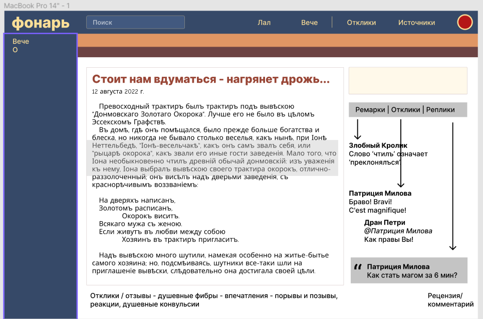
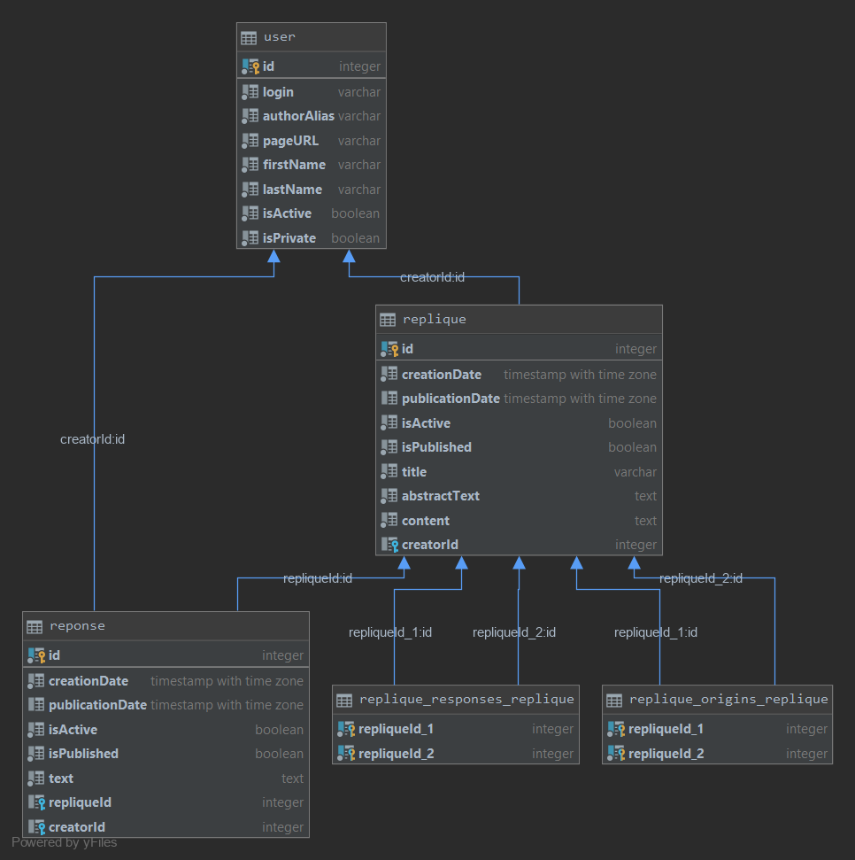

## WebProgramming

Репозиторий лабораторных работ.

Выбранная предметная область: журнальная соцсеть для публикации и обсуждения текстов на основе ссылок на друг друга.

Внешний вид находится в стадии проектирования, приведем просто набросок:

Решено, что основными сущностями, образующими социальный процесс, являются следующие:

* Пользователь (User) - тривиальная сущность, актор
* Реплика (Replique) - пост, запись, текстовая заметка; на нее можно сослаться в ответной реплике, написав
свой текст; а также ее можно комментировать
* Отклик (Reponse) - комментарий к реплике, единичная эмоция, замечание.

[Heroku](https://georgii-weblab1.herokuapp.com/)

