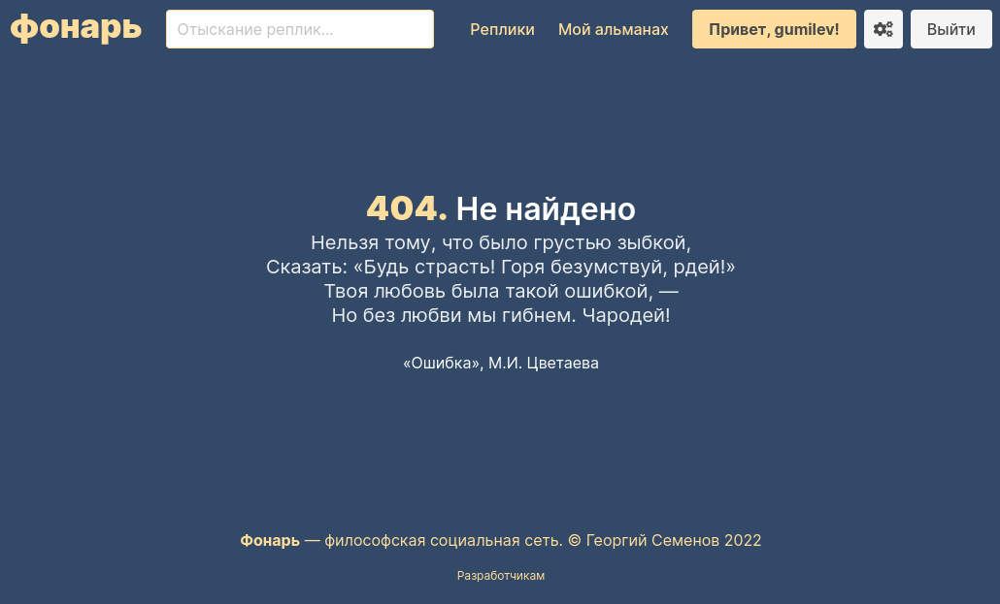

Философская социальная сеть «Фонарь», основанная на оригинальной механике реплик — пользовательских публикаций. Социальная сеть предназначена для просмотра и размещения авторских публицистических, художественных и философских текстов широкой тематики с возможностью цитирования ранее опубликованных текстов, а также оформления откликов — комментариев на эти тексты.

### Введение
Объектом разработки является философская социальная сеть «Фонарь» на языке программирования TypeScript с использованием фреймворка NestJS для серверной части приложения, а также языка программирования JavaScript без использования фреймворков для клиентской части приложения.

Целью работы является разработка веб-приложения и пользовательского интерфейса, анализ требований и моделирование процессов, средств автоматизации и архитектуры информационной системы.

В ходе работы были получены следующие результаты:
* Серверная часть системы, принимающая запросы
* Клиентская часть системы, предоставляющая интерфейс пользователя для создания и изменения пользовательского профиля, редактирования и публикации пользовательского контента;
* База данных для хранения информации о пользователях, пользовательских записях и комментариях

### Определения, обобщения и сокращения 

- `Браузер` — прикладное программное обеспечение для просмотра веб-страниц и содержания веб-документов.
- `Фреймворк` — программная платформа, определяющая структуру программной системы, а также набор программных инструментов, облегчающих разработку и объединение разных компонентов программного проекта.
- `Фронтенд` — клиентская сторона пользовательского интерфейса к программно-аппаратной части сервиса.
- `Бэкенд` — программно-аппаратная часть сервиса, отвечающая за функционирование его внутренней части.

В рамках предметной области также рассматриваются следующие термины:

- `Реплика (Replique)` – единица пользовательского контента в приложении; единоразовая публикация, состоящая из заголовка, текстовой вводной части (предисловия) и основной содержательной части, которая может быть ответом к другой реплике.
- `Отклик (Reponse)` – текстовый комментарий, оставленный к реплике.

### Описание предметной области

#### Описание прикладного процесса

Разрабатываемым веб-приложением является прототип философской социальной сети «Фонарь», основанной на оригинальной механике реплик — пользовательских публикаций. Социальная сеть предназначена для просмотра и размещения авторских публицистических, художественных и философских текстов широкой тематики с возможностью цитирования ранее опубликованных текстов, а также оформления откликов — комментариев на эти тексты.

При работе с классическими системами управления контентом, на основе которых надстраивается функциональность социальной сети, можно выделить ряд типовых задач, включая создание, редактирование, публикацию и удаление единиц контента. В рамках специфики «Фонаря» как социальной сети также рассматривается задача создания реплик-ответов и возможность комментирования опубликованных реплик.

#### Функциональные требования

Модуль работы с репликами (пользовательскими записями) должен иметь:
* Возможность создания реплики по заголовку
* Возможность редактирования заголовка, предисловия и текста реплики
* Возможность прикрепления реплик, ответом на которую является редактируемая реплика
* Возможность публикации реплики-наброска
* Возможность удаления реплики
* Отображение полного текста реплики и реплик, на которую отвечает текущая реплика
* Отображение реплик, опубликованных на сервисе

Модуль работы с пользователями должен иметь:
* Возможность регистрации нового пользователями
* Возможность аутентификации с помощью идентификатора и пароля
* Возможность изменения личных данных профиля пользователя
* Отображение пользовательского профиля
    
Модуль работы с откликами (комментариями) должен иметь:
* Возможность добавления отклика на реплику
* Отображение всех оставленных откликов на реплику

#### Нефункциональные требования

Разрабатываемая система должна предоставлять возможность просмотра опубликованных реплик для пользователей без регистрации.

Также должна быть возможность работы с приложением напрямую, через общие программные интерфейсы, описанные по спецификации OpenAPI версии не ниже 3.0

### Проектирование

#### Используемый стек технологий

Разработка системы в формате веб-приложения обусловлена необходимостью обеспечения доступа к системе с любого устройства, а также позволяет избежать необходимости синхронизации большого объема данных, свойственных социальным сетям.

Фронтенд использует стек стандартных фундаментальных технологий, характерных для веб-приложений: язык разметки HTML, язык стилей CSS, язык программирования JavaScript. Для разработки пользовательского интерфейса используется фреймворк Bulma на основе языка SCSS вместе с библиотекой BulmaJS. Для отправки запросов и отображения всплывающих уведомлений используются библиотеки JQuery и Toastr.

Бекенд состоит из веб-сервера Express и сокет-сервера Socket.IO в рамках фреймворка NestJS.

В качестве СУБД используется PostgreSQL ввиду того, что она поддерживает стандартный диалект языка запросов SQL, отказоустойчива и масштабируема. Библиотекой для работы с данными была выбрана технология программирования TypeORM.

В проекте используется свободная распределённая система управления версиями Git, хранилищем исходных кодов является крупнейший веб-сервис GitHub, а в качестве хостинга используется облачный сервис Heroku.

#### Системная архитектура

Клиент подключается к веб-серверу из веб-браузера с помощью протокола HTTPS. Для обеспечения работы веб-приложения используется сервер PostgreSQL, а также сторонний сервис для обеспечения аутентификации пользователей Supertokens.

Рисунок 1. Системная архитектура приложения.

#### Архитектура данных

Веб-приложение хранит и обрабатывает данные, являющиеся экземплярами трех сущностей: User (пользователь), Replique (реплика — запись), Reponse (отклик — комментарий):
- `User` — содержит данные пользовательского профиля, идентификатор страницы, именные подписи и идентификатор пользователя Supertokens.
- `Replique` — содержит заголовок, предисловие и текст публикации, даты создания и публикации, а также ссылки на User и другие Replique.
- `Reponse` — содержит ссылку на автора User и реплику Replique, дату публикации и текст комментария.

User обладает многими Replique и Reponse. Replique может быть ответом на другие Replique, поэтому соответствующее отношение оформлено в таблице replique_discours_replique. Replique может содержать несколько Reponse.

Рисунок 2. Схема таблиц базы данных

#### Программная архитектура

Таблица 1. Отношения модулей и классов
<table cellpadding="7" cellspacing="0">
    <colgroup>
        <col width="134"/>
        <col width="260"/>
        <col width="216"/>
    </colgroup>
    <tbody>
        <tr valign="top">
            <td width="134">
                

                    <strong>Название модуля</strong>
                

            </td>
            <td width="260">
                

                    <strong>Название класса</strong>
                

            </td>
            <td width="216">
                

                    <strong>Назначение класса</strong>
                

            </td>
        </tr>
        <tr valign="top">
            <td rowspan="5" width="134">
                

                    AuthModule
                

            </td>
            <td width="260">
                

                    AuthController
                

            </td>
            <td width="216">
                

                    Сервис (Контроллер)
                

            </td>
        </tr>
        <tr valign="top">
            <td width="260">
                

                    AuthFilter
                

            </td>
            <td width="216">
                

                    Фильтр исключений
                

            </td>
        </tr>
        <tr valign="top">
            <td width="260">
                

                    AuthMiddleware
                

            </td>
            <td width="216">
                

                    Промежуточный слой для подключения Supertokens
                

            </td>
        </tr>
        <tr valign="top">
            <td width="260">
                

                    guards / AuthGuard
                

            </td>
            <td width="216">
                

                    Guard для работы с пользовательским профилем
                

            </td>
        </tr>
        <tr valign="top">
            <td width="260">
                

                    guards / AuthRequiredGuard
                

            </td>
            <td width="216">
                

                    Guard, требующий авторизации пользователя
                

            </td>
        </tr>
        <tr valign="top">
            <td rowspan="3" width="134">
                

                    PageModule
                

            </td>
            <td width="260">
                

                    PageController
                

            </td>
            <td width="216">
                

                    Сервис (Контроллер)
                

            </td>
        </tr>
        <tr valign="top">
            <td width="260">
                

                    PageExceptionFilter
                

            </td>
            <td width="216">
                

                    Фильтр исключений
                

            </td>
        </tr>
        <tr valign="top">
            <td width="260">
                

                    LoggingInterceptor
                

            </td>
            <td width="216">
                

                    Класс для добавления данных о загрузке страницы
                

            </td>
        </tr>
        <tr valign="top">
            <td rowspan="6" width="134">
                

                    RepliqueModule
                

            </td>
            <td width="260">
                

                    RepliqueController
                

            </td>
            <td width="216">
                

                    Сервис (Контроллер)
                

            </td>
        </tr>
        <tr valign="top">
            <td width="260">
                

                    Publication
                

            </td>
            <td width="216">
                

                    Абстрактный класс для представления публикаций
                

            </td>
        </tr>
        <tr valign="top">
            <td width="260">
                

                    Replique
                

            </td>
            <td width="216">
                

                    Класс реплики
                

            </td>
        </tr>
        <tr valign="top">
            <td width="260">
                

                    dto / CreateRepliqueDto
                

            </td>
            <td width="216">
                

                    Класс для данных запроса создания реплики
                

            </td>
        </tr>
        <tr valign="top">
            <td width="260">
                

                    dto / UpdateRepliqueDto
                

            </td>
            <td width="216">
                

                    Класс для данных запроса обновления реплики
                

            </td>
        </tr>
        <tr valign="top">
            <td width="260">
                

                    guards / UserOwnsRepliqueGuard
                

            </td>
            <td width="216">
                

                    Guard для требования владением репликой
                

            </td>
        </tr>
        <tr valign="top">
            <td rowspan="3" width="134">
                

                    ReponseModule
                

            </td>
            <td width="260">
                

                    ReponseController
                

            </td>
            <td width="216">
                

                    Сервис (Контроллер)
                

            </td>
        </tr>
        <tr valign="top">
            <td width="260">
                

                    Reponse
                

            </td>
            <td width="216">
                

                    Класс отклика
                

            </td>
        </tr>
        <tr valign="top">
            <td width="260">
                

                    Dto / CreateReponseDto
                

            </td>
            <td width="216">
                

                    Класс для данных запроса создания отклика
                

            </td>
        </tr>
        <tr valign="top">
            <td width="134">
                

                    SocialbusModule
                

            </td>
            <td width="260">
                

                    GlobalGateway
                

            </td>
            <td width="216">
                

                    Сокет-сервис для обмена социальными сообщениями
                

            </td>
        </tr>
        <tr valign="top">
            <td rowspan="2" width="134">
                

                    UserModule
                

            </td>
            <td width="260">
                

                    UserController
                

            </td>
            <td width="216">
                

                    Сервис (Контроллер)
                

            </td>
        </tr>
        <tr valign="top">
            <td width="260">
                

                    User
                

            </td>
            <td width="216">
                

                    Класс пользователя
                

            </td>
        </tr>
        <tr valign="top">
            <td width="134">
                

                    AppModule
                

            </td>
            <td colspan="2" width="490">
                

                    –
                

            </td>
        </tr>
    </tbody>
</table>

Таблица 2. Описание классов
<table width="652" cellpadding="7" cellspacing="0">
	<colgroup>
		<col width="205"/>
		<col width="416"/>
	</colgroup>
	<tbody>
		<tr valign="top">
			<td width="205">
				

					<strong>Название класса</strong>
				

			</td>
			<td width="416">
				

					<strong>Описание класса</strong>
				

			</td>
		</tr>
		<tr valign="top">
			<td width="205">
				

					AppService
				

			</td>
			<td width="416">
				

					Класс, используемый для получения конфигурации
					веб-приложения, в т.ч. служебных ссылок
				

			</td>
		</tr>
		<tr valign="top">
			<td width="205">
				

					PageService
				

			</td>
			<td width="416">
				

					Класс, осуществляющий рендеринг и отображение страниц
					социальной сети, в т.ч. страницы входа и регистрации,
					списков опубликованных реплик, пользовательских профилей и
					редактора реплик, настроек пользователя
				

			</td>
		</tr>
		<tr valign="top">
			<td width="205">
				

					RepliqueService
				

			</td>
			<td width="416">
				

					Класс, обеспечивающий добавление, модификацию, удаление,
					просмотр и поиск пользовательских реплик
				

			</td>
		</tr>
		<tr valign="top">
			<td width="205">
				

					ReponseService
				

			</td>
			<td width="416">
				

					Класс, обеспечивающий добавление и просмотр
					пользовательских откликов
				

			</td>
		</tr>
		<tr valign="top">
			<td width="205">
				

					UserService
				

			</td>
			<td width="416">
				

					Класс, используемый для аутентификации и регистрации
					пользователей, изменения пользовательских данных, а также
					возвращения данных о конкретном пользователе
				

			</td>
		</tr>
		<tr valign="top">
			<td width="205">
				

					translation / TranslationService
				

			</td>
			<td width="416">
				

					Класс для хранения локализации переводов
				

			</td>
		</tr>
		<tr valign="top">
			<td width="205">
				

					supertokens / SupertokensService
				

			</td>
			<td width="416">
				

					Класс для подключения к провайдеру Supertokens
				

			</td>
		</tr>
	</tbody>
</table>

### Разработка

#### Реализация серверного API

В качестве описания программного интерфейса был выбран инструмент, поддерживающий стандарт OAS 3.0 – Swagger. Далее представлена полученная документация API полученная автоматически по директивам, указанным в декораторах различных методов и структурах данных внутри разрабатываемой информационной системы.

Рисунок 3. Программный интерфейс серверного API.

#### Реализация пользовательского интерфейса

Пользовательский интерфейс выполнен в рамках фирменного стиля Фонаря (цвета #FDDF97 и #364968), также используется шрифт Inter.

Регистрация и авторизация пользователя произодится с помощью соответствующих страниц. Интерактивные подсказки и мгновенная валидация помогают пользователю выбрать идентификатор и указать электронный адрес.

В своем профиле пользователь может просматривать свои наброски, а также опубликованные реплики. В правой панели можно создать новый набросок реплики, чтобы продолжить писать его текст. В шапке профиля показывается имя, псевдоним и описание пользователя.

На странице редактирования реплики пользователь может указать реплики, ответом на которые является текущая реплика, изменить название, предисловие и текст реплики в интерактивном редакторе EditorJS.

Пользователь может изменить отображаемые данные своего профиля на странице настроек.

Реплики на Фонаре отображаются в соответствующем разделе, и по ним можно производить поиск с помощью поискового текстового поля.

В оригинальном поэтическом стиле Фонаря оформлены и ошибки: 

Функционал откликов реализован в виде раздела под текстом реплики, с помощью которого можно оставить новый отклик и просмотреть предыдущие отклики.

### Заключение

В ходе выполнения курсовой работы был проведён анализ работы классических систем управления сайтами, исходя из которого были выявлены и сформированы требования к разрабатываемому веб-приложению.
Исходя из выбранной архитектуры и наложенных ограничений были сформированы требования к используемым технологиям внутри модулей. Была спроектирована архитектура данных, программная и системная архитектура в виде набора диаграмм в нотации UML.
Опираясь на выше изложенные требования и стек технологий было разработано веб-приложение и пользовательский интерфейс в рамках дисциплины «Web-программирование».

Таким образом, все поставленные ранее цели были выполнены. Разработанное приложение является результатом данной курсовой работы.
  
#### Список использованной литературы

1.	Мартин Фаулер - Архитектура корпоративных программных приложений. Издательский дом "Вильяме'. 2006 г.
2.	Флэнаган, Дэвид. JavaScript. Полное руководство, 7-е изд. : Пер. с англ. — СПб. : ООО “Диалектика”, 2021. — 720 с .
3.	Янг А., Мек Б., Кантелон М. Node.js в действии. 2-е изд. — СПб.: Питер, 2018. — 432 с.
4.	Браун И.Веб-разработка с применением Node и Express. Полноценное использование стека JavaScript. 2-е издание. — СПб.: Питер, 2021. — 336 с.
5.	Современный учебник JavaScript [Электронный ресурс]. – Режим доступа: https://learn.javascript.ru/. – Дата доступа: 04.05.2021.
